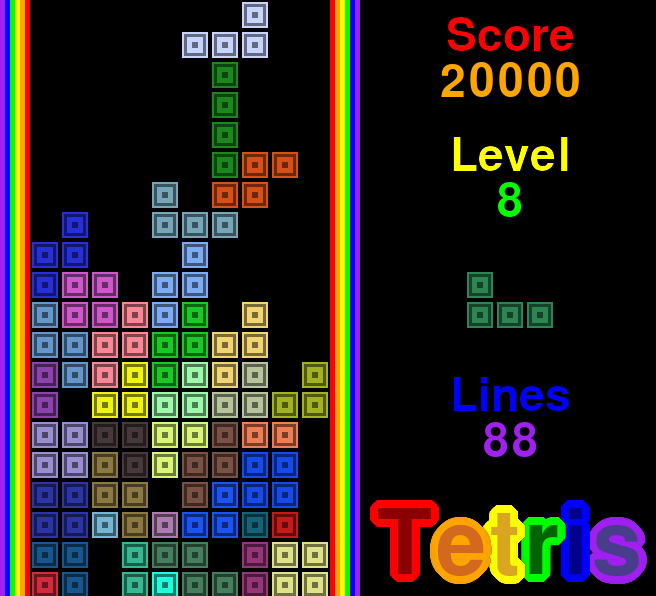

# Tetris (Python PyGame Zero)
Tetris is a legendary puzzle video game where players must strategically arrange falling geometric shapes called "Tetriminos" to create complete horizontal lines and clear them from the screen.

# Run
You will need PyGame Zero installed to run this. PyGame Zero may install or require PyGame and SDL2.

## ArchLinux instructions.

    sudo pacman -S --needed python-pip
    pip install --upgrade pgzero
    python main.py

# Controls
Left Arrow - Moves tetromino left.\
Right Arrow - Moves tetromino right.\
Up Arrow - Rotates tetromino.\
Down Arrow - Moves tetromino down.\
Space Bar - Starts Game.\
Escape - Quits/Closes Game.\
F - Enables showFPS.
