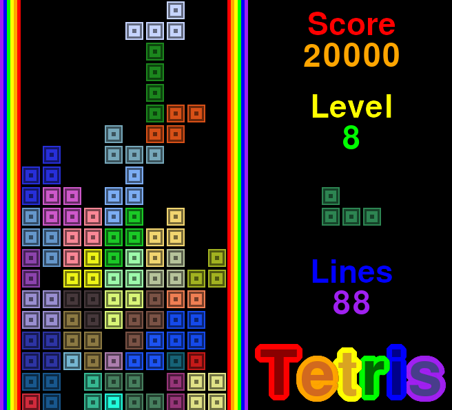

# Tetris
Tetris is a legendary puzzle video game where players must strategically arrange falling geometric shapes called "Tetriminos" to create complete horizontal lines and clear them from the screen.

# Build
To build the bubble-text binary you will need all required build tools needed to compile via Makefile and gcc. You will also need SDL2, SDL2_image and SDL2_ttf both the libraries and headerfiles.

# Controls
Left Arrow - Moves tetromino left.\
Right Arrow - Moves tetromino right.\
Up Arrow - Rotates tetromino.\
Down Arrow - Moves tetromino down.\
Space Bar - Starts Game.\
Escape - Quits/Closes Game.\
F - Enables showFPS.

# Ports
[C - SDL2](C-SDL2)
